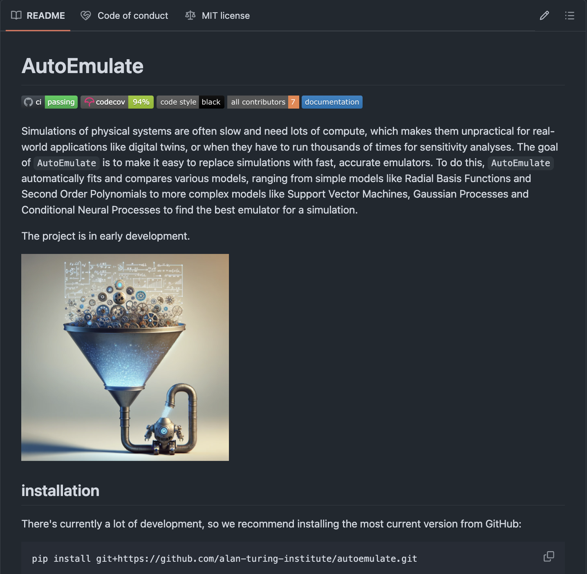

## Why do we emulate?

Real-world simulations are often too **slow** and **expensive** for ...

:::: {.columns}

::: {.column width="50%"}
* (Fast) prediction
* Sensitivity analysis
* Optimization
* Uncertainty Quantification
:::

::: {.column width="50%"}

:::

::: footer
Intro
:::

::::

## Building a (good) emulator is hard

1) Experimental design
    * Which inputs should we evaluate the simulation at?
2) Creating an emulator
    * Which model? Which hyperparameters? 
3) Applying the emulator
    * Sensitivity analysis, uncertainty quantification

* The goal of `AutoEmulate` is to make all of this easy! 

::: footer
Intro
:::

## Emulating an epidemic simulation with `AutoEmulate`

{fig-align="center"}

::: footer
Epidemic simulation
:::

## Epidemic simulation
:::: {layout="[ 55, 45 ]"}

::: {#first-column}

```{python}
from autoemulate.simulations.epidemic import simulate_epidemic
from autoemulate.experimental_design import LatinHypercube
import matplotlib.pyplot as plt
import numpy as np

plt.style.use('default')  # Apply dark background style

beta = (0.1, 0.5) # lower and upper bounds for the transmission rate
gamma = (0.01, 0.2) # lower and upper bounds for the recovery rate
lhd = LatinHypercube([beta, gamma])
X = lhd.sample(70)
y = np.array([simulate_epidemic(x) for x in X])

# Extract launch angles and thrusts for plotting
beta = X[:, 0]
gamma = X[:, 1]

# Create the scatter plot
plt.figure(figsize=(7, 5))
sc = plt.scatter(beta, gamma, c=y, cmap='plasma', s=50)  # Increase point size to 50

cbar = plt.colorbar(sc)  
cbar.set_label('Maximum number of infections', fontsize=15)
plt.xlabel('Transmission rate', fontsize=15)
plt.ylabel('Recovery rate', fontsize=15)
plt.grid(True)
plt.show()
```

:::

::: {#second-column}

* Input **X**: transmission rate, recovery rate  
* Output **y**: maximum number of infections 
* Problem: simulation takes too long 
* Solution: build an emulator

:::

::::

::: footer
Epidemic simulation
:::

## `AutoEmulate` - building an epidemic emulator

```{python}
#| echo: True
#| output: False
from autoemulate.compare import AutoEmulate

ae = AutoEmulate()
ae.setup(X, y)    # X=transmission rate,recovery rate; y=max infections
ae.compare()      # compares and cross-validates various models
```
  
. . .

Behind the scenes, `AutoEmulate` ...

* **pre-processes** the data
* **fits** and **cross-validates** various models
* optionally: **optimises** model hyperparameters

## Cross-validation results {.smaller}

```{python}
#| echo: True
#| output: True
ae.summarise_cv()
```


## Cross-validation results {.smaller}

```{python}
#| echo: True
#| layout-nrow: 2
ae.plot_cv(n_cols=3, model='GaussianProcess')
```

## Evaluate on the test set

```{python}
#| echo: True
#| output: asis
gp = ae.get_model("GaussianProcess")
ae.evaluate(gp)
```


## Emulator: Prediction


```{python}
#| echo: True
#| output: asis
gp = ae.refit(gp) # use all data to fit the emulator

# Create 10k inputs to predict on
X = np.array(np.meshgrid(np.linspace(0.1, 0.5, 100), np.linspace(0.01, 0.2, 100))).T.reshape(-1, 2)

# Emulate the epidemic simulation using the best model
y = gp.predict(X)
```


```{python}
#| echo: False
#| output: asis
#| fig-align: center
beta = X[:, 0]
gamma = X[:, 1]

# Create the scatter plot
plt.figure(figsize=(2, 1.5))  # Adjust the figure size to be larger than 1.5x1.5 for better visibility
sc = plt.scatter(beta, gamma, c=y, cmap='plasma', s=30)  # Reduce point size to 30
cbar = plt.colorbar(sc)  
cbar.set_label('Maximum \n % infections', fontsize=8)  # Reduce font size
cbar.ax.tick_params(labelsize=7) 
plt.xlabel('Transmission rate', fontsize=8)  # Reduce font size
plt.ylabel('Recovery rate', fontsize=8)  # Reduce font size
plt.xticks(fontsize=7)
plt.yticks(fontsize=7)

plt.grid(True)
plt.show()
```


## Emulator: Sensitivity analysis

```{python}
#| echo: True
#| output: asis
#| out-width: 50%
#| fig-align: center
from autoemulate.sensitivity_analysis import sensitivity_analysis, plot_sensitivity_analysis

problem = {'num_vars': 2,'names': ['beta', 'gamma'],
            'bounds': [[0.1, 0.5], [0.01, 0.2]]}

results = sensitivity_analysis(gp, problem, as_df=True)
plot_sensitivity_analysis(results)
```

## Customisation {}

-> idea: balance simplicity and customisation

```{python}
#| echo: true
#| eval: false
#| code-line-numbers: "1|4|5|6|7|8"
# set up
ae = AutoEmulate()
ae.setup(X, y,                      # simulation input and output
         param_search=True,         # search for best hyperparameters
         scale_inputs=True,         # standardise input 
         cross_validator=KFold(),   # use k-fold cross-validation
         reduce_dim=True,           # reduce dimensionality
         n_jobs=4)                  # parallelise computation
# ae.compare()
```


## Take-away

* `AutoEmulate` **makes emulation easy**
    * provides various emulator models incl. cutting-edge Neural Processes
    * semi-automated model selection / optimisation
    * compatible with the [scikit-learn](https://scikit-learn.org/stable/){preview-link="true"} ecosystem
    * simple, but customisable
    * *soon*: emulator applications like sensitivity analysis

## Future work

:::: {.columns}

::: {.column width="50%"}
* goal: `AutoEmulate` as an end-to-end low-code emulation framework
* it's open source: please test it, provide feedback, and contribute!
:::

::: {.column width="50%"}


:::

::::

## Thanks to:

::: {.columns }
::: {.column width="50%" .nonincremental}
##### Collaborators:  

    * Steven Niederer (Imperial)
    * Eric Daub (Turing)
    * Kalle Westerling (Turing)
    * Sophie Arana (Turing)
    * Bryan Lee (Turing, Uni Edinburgh)
    * Max Balmus (Imperial, Turing)
:::

::: {.column width="50%" .nonincremental}
##### Discussions / data:  

    * Keith Worden (Turing)
    * Zack Xuereb Conti (Turing)
    * Marina Strocchi (Imperial)
    * Rosie Williams (BAS)
    * Ieva Kazlauskaite (BAS)
    * Robert Arthern (BAS)
:::
:::

::: footer
https://github.com/alan-turing-institute/autoemulate
:::

