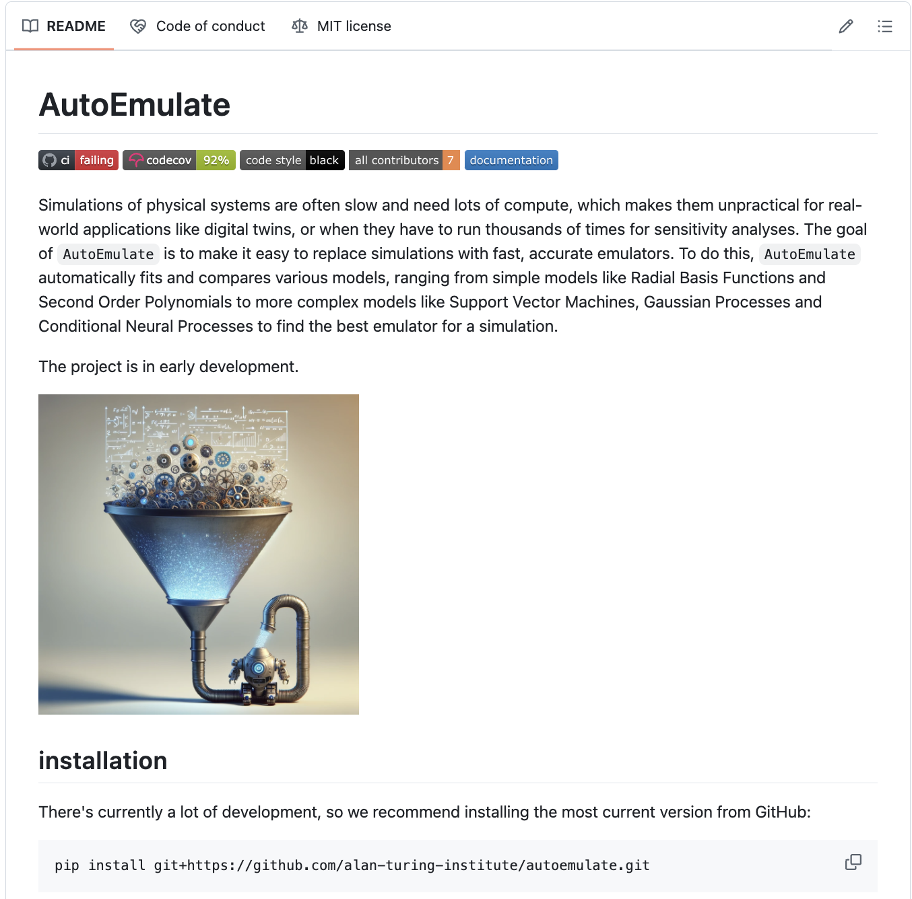

## AutoEmulate - AutoML for surrogate modeling

:::: {.columns}

::: {.column width="50%"}
* (Fast) prediction
* Sensitivity analysis
* Optimization
* Uncertainty Quantification
:::

::: {.column width="50%"}

:::

::: footer
Intro
:::